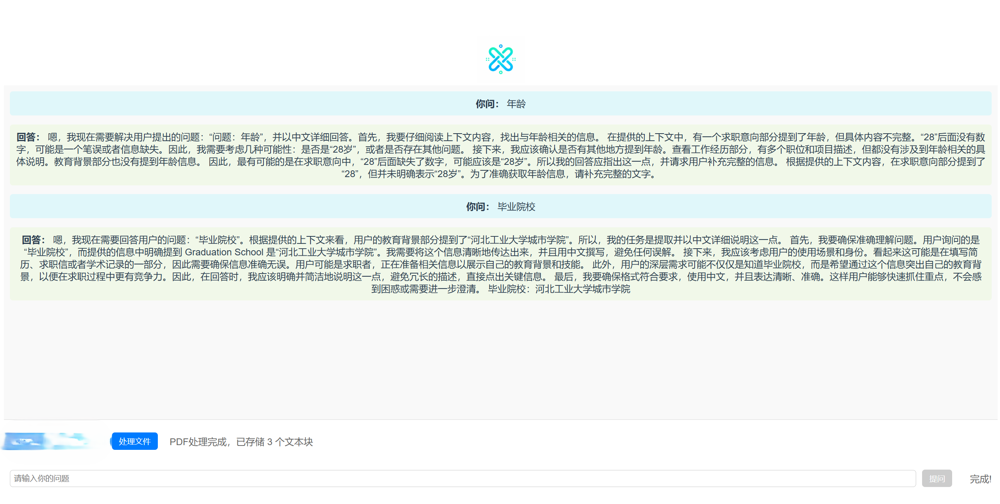

# 简介
本地pdf文档问答系统
# 技术栈
ollama+deepseek  
FastAPI  
LangChain  
chromadb  
all-MiniLM-L6-v2  
# 运行
1. 安装依赖环境 
```
pip install -r requirements.txt
```
2. 运行deepseek
```commandline
ollama run deepseek:7b
```
3. 运行rag_backend.py
# 页面展示



# 待优化
1. 部署高性能向量数据库
2. 优化多轮对话功能